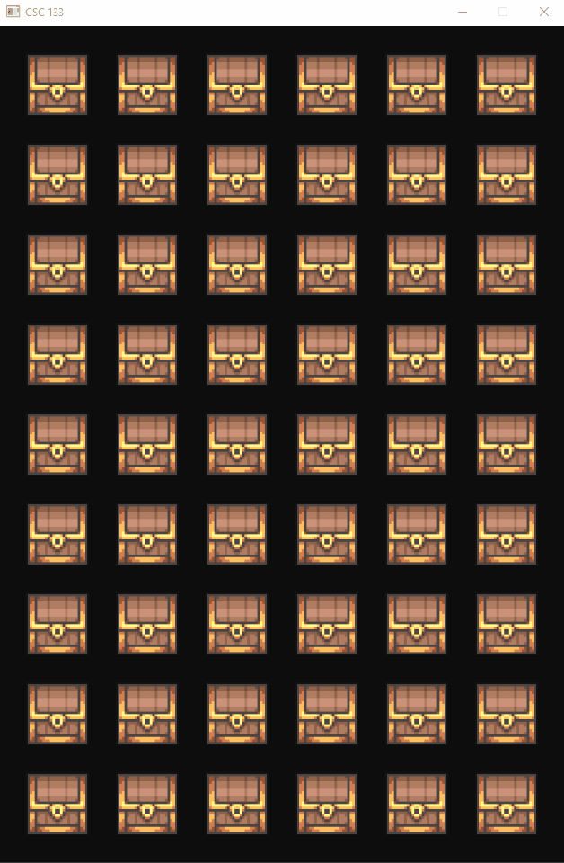

# Minesweeper

## Description
This project was part of an assignment for a Computer Graphics and Object-Oriented 
Programming course I took during Spring 2024.

Recreates the classic game minesweeper. Clicking on chests that have gold in them will increase
the user's score, but clicking on a chest that has a mine in it will explode, reveal the
entire board, and cause an instant game over. Clicking all the chests that have gold in
them leads to victory!

## Objective
Combine everything we have learned throughout the course. Drawing and rendering a grid of
squares, shader/composite texture management, mouse clicking logic, and texture changing.

## Stack
Lightweight Java Game Library (lwjgl) and OpenGL.

## Demo
